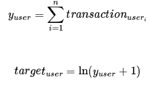

# Google Store Customer Revenue Prediction
R Studio has partnered with Kaggle and Google to demonstrate that only a few of the customers produce most of the revenue for many businesses. To do that they collected data from one of Google's stores about their customers and they ask us to predict how much money they spent.

## Dataset information

The dataset consists of two csv files for training and testing respectively, they come with 14 columns each and some fields are a json object but only in the training dataset, most others are numeric or categorical.

The columns are the following:
- fullVisitorId- A unique identifier for each user of the Google Merchandise Store.
- channelGrouping - The channel via which the user came to the Store.
- date - The date on which the user visited the Store.
- device - The specifications for the device used to access the Store.
- geoNetwork - This section contains information about the geography of the user.
- socialEngagementType - Engagement type, either "Socially Engaged" or "Not Socially Engaged".
- totals - This section contains aggregate values across the session.
- trafficSource - This section contains information about the Traffic Source from which the session originated.
- visitId - An identifier for this session. This is part of the value usually stored as the _utmb cookie. This is only unique to the user. For a completely unique ID,you should use a combination of fullVisitorId and visitId.
- visitNumber - The session number for this user. If this is the first session, then this is set to 1.
- visitStartTime - The timestamp (expressed as POSIX time).
- hits - This row and nested fields are populated for any and all types of hits. Provides a record of all page visits.
- customDimensions - This section contains any user-level or session-level custom dimensions that are set for a session. This is a repeated field and has an entry for each dimension that is set.
- totals - This set of columns mostly includes high-level aggregate data.

### Predicted Value
The y column is **transactionRevenue** that is contained within the **totals** json object, it only exists on the training data. Since we are given transactions and a date, we are asked to predict the natural log of the sum of all transactions per user for the period of December 1st,2018 to January 31st,2019.

The target value is calculated in the following way:
  

## Things to learn
I find the data very interesting because i am not used to json data in this setting and i would consider at least exploring the dataset because of its nature. That said, i also think that probably wouldn't be the best project to start with because it may be difficult for us to work with such data from the start.

## Difficulties & Timing
As said before, the data may present some initial problems though they probably could be overcomed with us getting used to it. 
After the initial exploration of the data we would further assess the difficulty of the problem.

The competition ended a long time ago so there's that.

## Score
### **7/10**
Good all around use-case, simple prediction formula, simple type of data analysis, not so usual data columns.

https://www.kaggle.com/competitions/ga-customer-revenue-prediction/data
